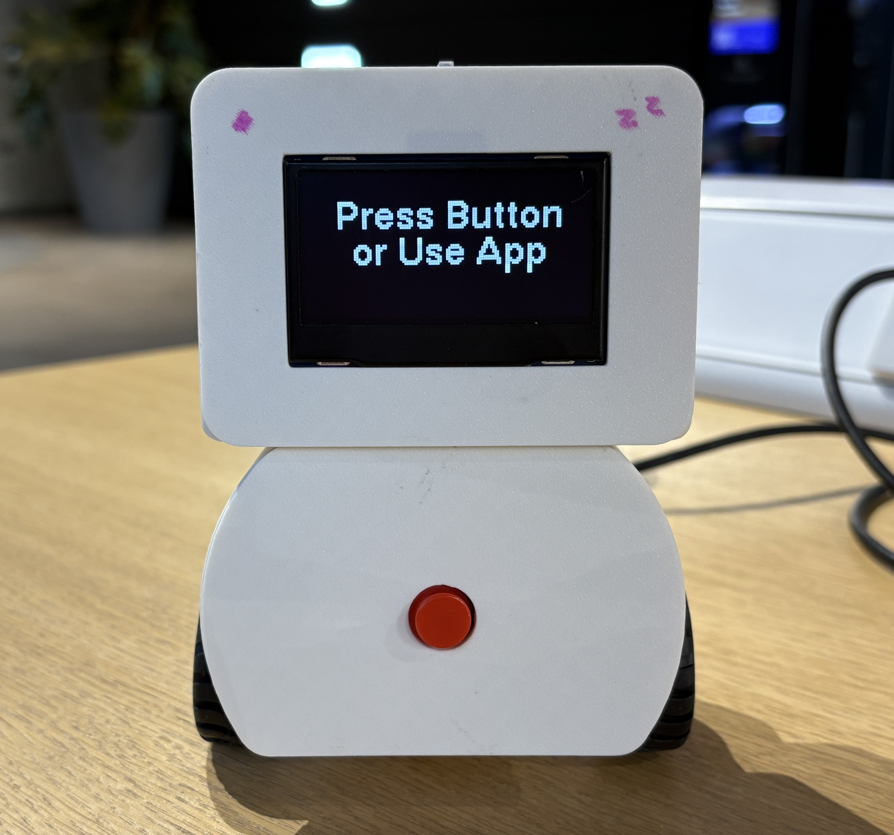

# PomoBot 🤖 — Your Desk Companion
Meet PomoBot — your tiny desk companion that keeps you on track with the Pomodoro Technique 🍅.  
By default, it runs in 25-minute focus sessions followed by 5-minute breaks, making it easier to shift between work and break and stay productive throughout the day.  
  
# Features
* 🍅 Pomodoro Timer
   25 minutes of focus time and 5 minutes of break time. You can also customize the duration and number of rounds through the app.
* 🤖 Desk Companion
  During focus time, it stays quietly by your side. During breaks, it moves around to remind you to relax and take a short rest.
* ⌨️ Typing Activity Detection
  If you haven’t been working for a while — no typing sounds are detected by the on-device ML model  — it gently reminds you to refocus.
* 🌡️ Study Environment Monitoring
  A light sensor detects if the room is too dim , and a CO₂ sensor monitors air quality. When CO₂ levels are high, it warns you before you start to feel sleepy.
  # installation
Download the latest APK release directly from the [Releases](https://github.com/yingwuhola/Pomodoro-Robot/releases) pages.  
Install the APK on your Android device.
