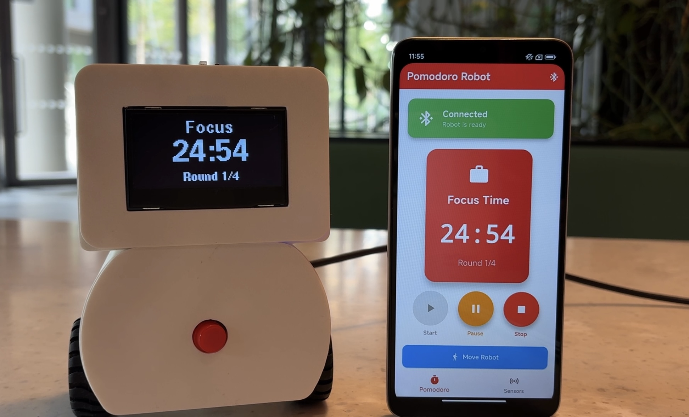

# PomoBot 🤖 — Your Desk Companion
Meet PomoBot — your tiny desk companion that helps you stay on track with the Pomodoro Technique🍅, keeping you focused and productive all day.  

. 

# 🌟 Features
### * ⏱️ Pomodoro Timer.  
   
 25 minutes of focus time and 5 minutes of break time. You can also customize the duration and number of rounds through the app.  

### * 🤝 Desk Companion

   During focus time, it stays quietly by your side. During breaks, it moves around to remind you to relax and take a short rest.  

### * ⌨️ Typing Activity Detection

   Built-in machine learning detects typing sounds. If no activity is detected for a while, it gently prompts you to get back on track.  

### * 🌱 Study Environment Monitoring

   A light sensor ensures proper brightness, while a CO₂ sensor alerts you when it’s time to open a window.

# Installation
## Hardware  
### 1. Circuit Design  
* Microcontroller:  ESP32
* Sensors:
   VEML7700 Light Sensor
   SGP30 eCO₂ & TVOC Air Quality Sensor
   INMP441 Microphone (for typing sound detection)
* Actuators:
   N20 DC Motor (for movement)
   TB6612 Motor Driver
   Speaker (for gentle alerts or reminders)
* Display: SD1309 OLED Screen
* Inputs: Push Button
 #### Circuit Diagram

### 2. Machine Learning Model
 Detects typing activity based on sound
 Input: Audio from microphone
 Output: “Typing†or “Not Typingâ€
 Link: https://studio.edgeimpulse.com/studio/716593

## Software  
* Download the latest APK release directly from the [Releases](https://github.com/yingwuhola/Pomodoro-Robot/releases) pages.  
* Install the APK on your Android device. 

 
* BLE Bluetooth Connection
* Pomodoro Start/Pause Control
* Custom Time Settings
* Environment Data Monitoring